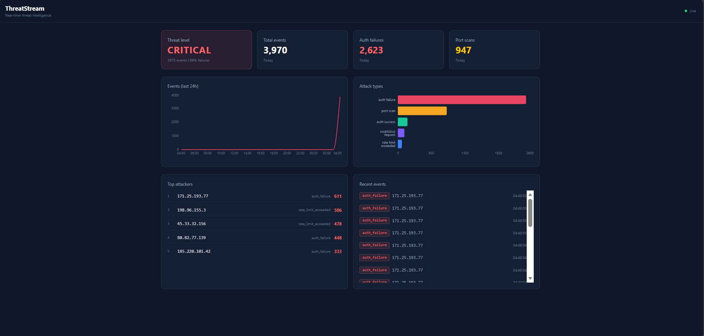

# ThreatStream

> Real-time threat intelligence pipeline that ingests security events, streams them through Kafka, detects attack patterns, and displays live threat analytics on a cybersecurity dashboard.

[](https://github.com/Aliromia21/threatstream/actions/workflows/ci.yml)

---

## Why This Project Exists

Security operations centers monitor thousands of events per second — failed logins, port scans, suspicious requests. This project demonstrates how to build the backend infrastructure that powers real-time threat detection and visualization, using the same architectural patterns found in production systems at companies like CrowdStrike, Splunk, and Datadog.

---

## System Architecture
```
                    ┌──────────────────────────────────────────────────────┐
                    │                   Docker Network                     │
                    │                                                      │
                    │   ┌────────────┐    ┌─────────┐    ┌────────────┐   │
                    │   │ Event API  │───▶│  Kafka  │───▶│  Consumer  │   │
                    │   │  :3001     │    │  :9092  │    │            │   │
                    │   └────────────┘    └─────────┘    └─────┬──────┘   │
                    │         ▲                                │          │
                    │         │                                ▼          │
                    │   ┌────────────┐               ┌──────────────┐    │
                    │   │ Simulator  │               │  PostgreSQL  │    │
                    │   │ (threats)  │               │    :5432     │    │
                    │   └────────────┘               └───────┬──────┘    │
                    │                                        │           │
                    │                                 LISTEN/NOTIFY      │
                    │                                        │           │
                    │   ┌────────────┐               ┌───────▼──────┐   │
                    │   │ Dashboard  │◀── WebSocket ──│  Stats API  │   │
                    │   │   :8080    │               │    :3003     │   │
                    │   └────────────┘               └──────────────┘   │
                    │                                                      │
                    └──────────────────────────────────────────────────────┘
```

### Data Flow

1. **Simulator** generates realistic attack patterns (brute force, port scans, normal traffic) and sends them via HTTP
2. **Event API** validates, enriches (adds UUID, timestamp), and produces events to Kafka topics — responds in <5ms
3. **Kafka** streams events across 3 topics: `auth-events`, `network-events`, `threat-alerts` — partitioned by source IP
4. **Consumer** reads events, writes to PostgreSQL (raw events + pre-aggregated counters), and runs sliding-window threat detection
5. **PostgreSQL** stores raw events, daily stats, attack sources, and threat alerts — notifies Stats API via LISTEN/NOTIFY
6. **Stats API** serves REST endpoints for historical data and pushes live updates to the dashboard via WebSocket
7. **Dashboard** renders real-time threat analytics with auto-updating charts, threat level indicator, and live event feed

---

## Features

### Event Ingestion
- High-performance HTTP endpoint — validates and produces to Kafka with <5ms response time
- Event enrichment with UUID and server-side timestamp
- Topic routing based on event type (auth → `auth-events`, network → `network-events`)
- Partition key = source IP — guarantees event ordering per attacker



### Threat Detection
- **Brute Force Detection** — 10+ auth failures from same IP within 2 minutes triggers HIGH severity alert
- **Port Scan Detection** — 8+ unique ports scanned from same IP within 1 minute triggers MEDIUM severity alert
- In-memory sliding window with automatic stale-entry cleanup
- Alerts persisted to PostgreSQL with severity, description, and related metadata

### Real-Time Dashboard
- Live threat level indicator (LOW / MEDIUM / HIGH / CRITICAL) based on failure ratio
- Event timeline chart (last 24 hours, hourly granularity)
- Attack type breakdown (bar chart)
- Top attackers table with event counts and last seen info
- Scrolling live event feed with color-coded type badges
- WebSocket connection with auto-reconnect and connection status indicator
- Loading skeletons and flash animations on value changes

### Data Architecture
- **Dual-write pattern** — raw events stored for historical analysis + pre-aggregated counters for O(1) dashboard reads
- **UPSERT with ON CONFLICT** — atomic counter updates without race conditions
- **PostgreSQL LISTEN/NOTIFY** — bridges Consumer and Stats API without additional infrastructure
- **1-second WebSocket batching** — collects events then broadcasts summary, preventing client flooding

### Infrastructure
- 7 containers orchestrated with Docker Compose (single command startup)
- Multi-stage Docker builds — production images ~150MB vs ~500MB with dev dependencies
- Health checks with dependency ordering — services start only when their dependencies are ready
- Graceful shutdown — Kafka producers and consumers disconnect cleanly on SIGTERM/SIGINT

---

## Quick Start
```bash
# Clone the repository
git clone https://github.com/Aliromia21/threatstream.git
cd threatstream

# Start all services
docker compose up --build

# Start with threat simulator (generates live attack data)
docker compose --profile demo up --build
```

| Service | URL |
|---------|-----|
| Dashboard | http://localhost:8080 |
| Event API | http://localhost:3001 |
| Stats API | http://localhost:3003 |
| Health Check | http://localhost:3001/health |

### Send a manual event
```bash
curl -X POST http://localhost:3001/events \
  -H "Content-Type: application/json" \
  -d '{
    "type": "auth_failure",
    "sourceIp": "185.220.101.42",
    "timestamp": "2026-03-20T10:00:00Z",
    "metadata": { "username": "admin", "userAgent": "curl/7.88" }
  }'
```

---

## Tech Stack

| Layer | Technology | Why |
|-------|-----------|-----|
| Event Streaming | Apache Kafka | Immutable event log with independent consumer groups — events stored, not deleted after processing |
| Database | PostgreSQL 16 | JSONB for flexible metadata, UPSERT for atomic counters, LISTEN/NOTIFY for real-time bridge |
| Backend | Node.js, TypeScript, Express | Non-blocking I/O for high-throughput event processing |
| Frontend | React 18, Vite, Tailwind CSS, Recharts | Fast builds, utility-first styling, declarative charts |
| Real-time | WebSockets (ws library) | Server-push without polling overhead — 50KB library vs 300KB socket.io |
| DevOps | Docker, Docker Compose, GitHub Actions | Reproducible environments, automated testing, single-command deployment |

---

## Project Structure
```
threatstream/
├── docker-compose.yml              # Orchestrates all 7 containers
├── services/
│   ├── event-api/                   # HTTP → Kafka producer
│   │   ├── src/
│   │   │   ├── config/              # Fail-fast environment validation
│   │   │   ├── kafka/               # Producer singleton + topic router
│   │   │   ├── routes/              # /health, /events endpoints
│   │   │   ├── validators/          # Event schema validation
│   │   │   ├── middleware/          # Centralized error handler
│   │   │   └── __tests__/           # Unit + integration tests
│   │   └── Dockerfile
│   ├── consumer/                    # Kafka → PostgreSQL + threat detection
│   │   ├── src/
│   │   │   ├── kafka/               # Consumer group subscription
│   │   │   ├── database/            # Connection pool
│   │   │   ├── processors/          # Event processor + threat detector
│   │   │   └── __tests__/           # Threat detection tests
│   │   └── Dockerfile
│   ├── stats-api/                   # REST + WebSocket server
│   │   ├── src/
│   │   │   ├── routes/              # /stats/* endpoints
│   │   │   ├── websocket/           # WS server + PG LISTEN/NOTIFY bridge
│   │   │   └── database/            # Read-only connection pool
│   │   └── Dockerfile
│   ├── simulator/                   # Realistic threat event generator
│   │   ├── src/
│   │   │   ├── patterns/            # Brute force, port scan, normal traffic
│   │   │   └── config/
│   │   └── Dockerfile
│   └── dashboard/                   # React frontend
│       ├── src/
│       │   ├── hooks/               # useWebSocket, useStats
│       │   └── components/          # StatCard, ThreatLevel, Charts, etc.
│       └── Dockerfile
├── infrastructure/
│   └── postgres/
│       └── init.sql                 # Schema: 5 tables with indexes
└── shared/
    └── types/                       # Shared TypeScript event definitions
```

---

## Database Schema

| Table | Purpose | Access Pattern |
|-------|---------|---------------|
| `events` | Immutable log of every raw event (JSONB metadata) | Write-heavy, queried for recent events and timeline |
| `daily_stats` | Pre-aggregated daily counters | O(1) reads for dashboard summary |
| `attack_sources` | Top attackers per day (IP + event count) | Read by dashboard top-attackers panel |
| `sessions` | Active attack session tracking | Updated per event, queried for active threats |
| `threat_alerts` | Classified threats from anomaly detection | Written by threat detector, read by alerts panel |

---

## Testing
```bash
# Run all tests
cd services/event-api && npx jest --coverage
cd services/consumer && npx jest --coverage
```

| Layer | Count | What It Tests |
|-------|-------|--------------|
| Unit | 23+ | Event validation (types, IPs, timestamps), topic routing, threat detection thresholds and windows |
| Integration | 4+ | HTTP endpoints with mocked Kafka — validates request/response cycle |
| Docker | 5 builds | All services compile and build successfully in CI |

### CI/CD

Every push to `main` triggers the GitHub Actions pipeline: lint → test → Docker build verification.

---

## Key Design Decisions

| Decision | Trade-off | Alternative |
|----------|-----------|-------------|
| **Kafka over BullMQ** | More infrastructure, but events are an immutable log — multiple consumers can read independently | BullMQ deletes jobs after processing |
| **sourceIp as partition key** | Risk of hot partitions if one IP dominates | Random partitioning — better load distribution but no ordering guarantee |
| **Pre-aggregated tables** | Dual-write complexity, but dashboard reads are O(1) | Materialized views — less code but less control over refresh timing |
| **PostgreSQL LISTEN/NOTIFY** | Couples Consumer and Stats API through the database | HTTP between services — more flexible but adds another endpoint |
| **ws over socket.io** | No auto-reconnect or rooms built-in, but 50KB vs 300KB | socket.io — easier API but heavier |
| **In-memory sliding windows** | State lost on restart, but <1ms detection | Redis — shared state across instances but adds infrastructure |
| **Manual validation over Zod** | More code, but full understanding of what's validated | Zod — less code, automatic TypeScript inference |

---

## API Reference

### Event API (port 3001)

| Method | Endpoint | Description |
|--------|----------|-------------|
| POST | `/events` | Ingest a security event (returns 202) |
| GET | `/health` | Service health + Kafka connection status |

### Stats API (port 3003)

| Method | Endpoint | Description |
|--------|----------|-------------|
| GET | `/stats/today` | Today's aggregated threat summary |
| GET | `/stats/week` | Last 7 days of daily stats |
| GET | `/stats/top-attackers` | Top 10 IPs by event count |
| GET | `/stats/attack-types` | Event count grouped by type |
| GET | `/stats/timeline` | Hourly event counts (last 24h) |
| GET | `/stats/recent-events` | Last 20 events |
| GET | `/stats/alerts` | Recent threat alerts |
| WS | `ws://localhost:3003` | Live stats updates (1-second batches) |

---

## What I Learned Building This

This project pushed me from job-queue architectures (BullMQ) to event streaming (Kafka), from document databases (MongoDB) to relational modeling (PostgreSQL), and from monolith modules to true microservices with independent Dockerfiles and deployment lifecycles.

The most valuable insight: **pre-aggregated tables change everything**. Reading one row from `daily_stats` instead of counting millions of events is the difference between a dashboard that loads in 5ms and one that takes 3 seconds. Every production analytics system I've studied uses some form of this pattern.

---

## Author

**Ali Romia** — Software Engineer

- GitHub: [github.com/Aliromia21](https://github.com/Aliromia21)
- LinkedIn: [linkedin.com/in/aliromia](https://www.linkedin.com/in/aliromia/)

---

## License

MIT License © Ali Romia 2026